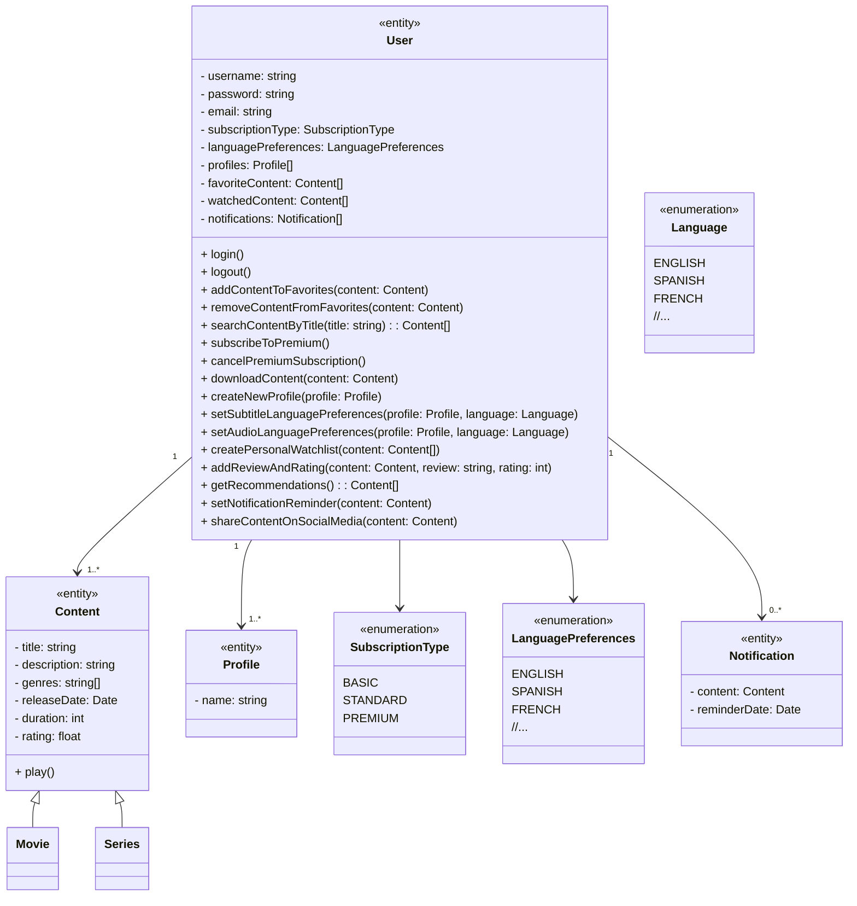
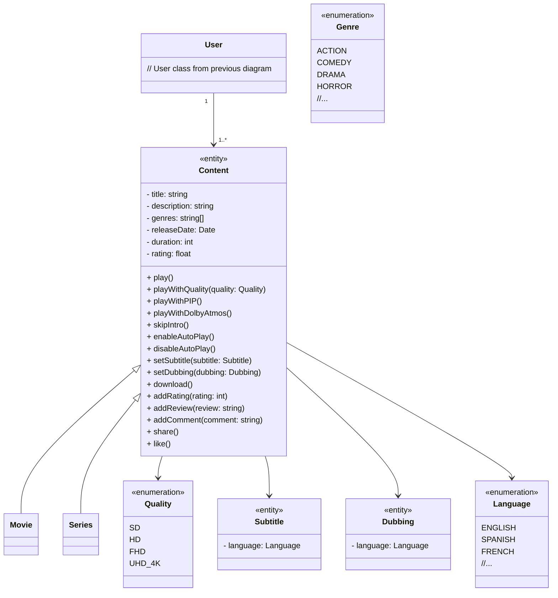
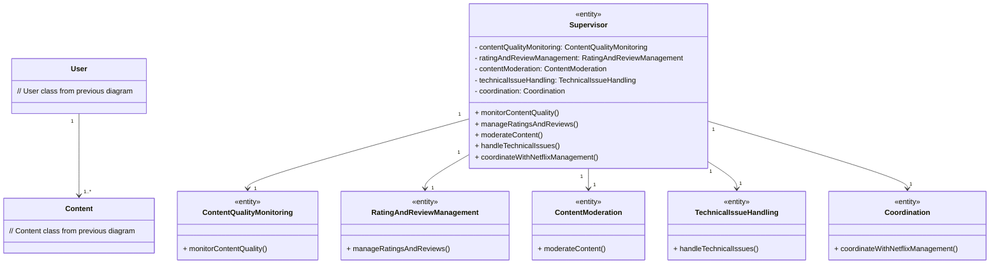

## Class diagram use case user

```mermaid
classDiagram
    class User {
        <<entity>>
        - username: string
        - password: string
        - email: string
        - subscriptionType: SubscriptionType
        - languagePreferences: LanguagePreferences
        - profiles: Profile[]
        - favoriteContent: Content[]
        - watchedContent: Content[]
        - notifications: Notification[]
        + login()
        + logout()
        + addContentToFavorites(content: Content)
        + removeContentFromFavorites(content: Content)
        + searchContentByTitle(title: string): Content[]
        + subscribeToPremium()
        + cancelPremiumSubscription()
        + downloadContent(content: Content)
        + createNewProfile(profile: Profile)
        + setSubtitleLanguagePreferences(profile: Profile, language: Language)
        + setAudioLanguagePreferences(profile: Profile, language: Language)
        + createPersonalWatchlist(content: Content[])
        + addReviewAndRating(content: Content, review: string, rating: int)
        + getRecommendations(): Content[]
        + setNotificationReminder(content: Content)
        + shareContentOnSocialMedia(content: Content)
    }

    class Content {
        <<entity>>
        - title: string
        - description: string
        - genres: string[]
        - releaseDate: Date
        - duration: int
        - rating: float
        + play()
    }

    class Profile {
        <<entity>>
        - name: string
    }

    class SubscriptionType {
        <<enumeration>>
        BASIC
        STANDARD
        PREMIUM
    }

    class LanguagePreferences {
        <<enumeration>>
        ENGLISH
        SPANISH
        FRENCH
        //...
    }

    class Language {
        <<enumeration>>
        ENGLISH
        SPANISH
        FRENCH
        //...
    }

    class Notification {
        <<entity>>
        - content: Content
        - reminderDate: Date
    }

    User "1" --> "1..*" Profile
    User "1" --> "1..*" Content
    User "1" --> "0..*" Notification
    User --> SubscriptionType
    User --> LanguagePreferences
    Content <|-- Movie
    Content <|-- Series
```

## Class diagram use case film & series

```mermaid
classDiagram
    class User {
        // User class from previous diagram
    }

    class Content {
        <<entity>>
        - title: string
        - description: string
        - genres: string[]
        - releaseDate: Date
        - duration: int
        - rating: float
        + play()
        + playWithQuality(quality: Quality)
        + playWithPIP()
        + playWithDolbyAtmos()
        + skipIntro()
        + enableAutoPlay()
        + disableAutoPlay()
        + setSubtitle(subtitle: Subtitle)
        + setDubbing(dubbing: Dubbing)
        + download()
        + addRating(rating: int)
        + addReview(review: string)
        + addComment(comment: string)
        + share()
        + like()
    }

    class Quality {
        <<enumeration>>
        SD
        HD
        FHD
        UHD_4K
    }

    class Subtitle {
        <<entity>>
        - language: Language
    }

    class Dubbing {
        <<entity>>
        - language: Language
    }

    class Language {
        <<enumeration>>
        ENGLISH
        SPANISH
        FRENCH
        //...
    }

    class Genre {
        <<enumeration>>
        ACTION
        COMEDY
        DRAMA
        HORROR
        //...
    }

    User "1" --> "1..*" Content
    Content <|-- Movie
    Content <|-- Series
    Content --> Quality
    Content --> Subtitle
    Content --> Dubbing
    Content --> Language
```

## Class diagram use case manajemen

```mermaid
classDiagram
    class Management {
        <<entity>>
        - contentManagement: ContentManagement
        - dataAnalysis: DataAnalysis
        - userManagement: UserManagement
        - financeManagement: FinanceManagement
        - promotionManagement: PromotionManagement
        - contentPartnerManagement: ContentPartnerManagement
        - bugManagement: BugManagement
        - internationalContentManagement: InternationalContentManagement
        - userBehaviorAnalysis: UserBehaviorAnalysis
        - featureDevelopment: FeatureDevelopment
        - marketResearch: MarketResearch
        - infrastructureManagement: InfrastructureManagement
        - affiliateProgramManagement: AffiliateProgramManagement
        + addContent(content: Content)
        + analyzeData()
        + manageUsers()
        + manageFinance()
        + managePromotion()
        + manageContentPartners()
        + manageBugs()
        + manageInternationalContent()
        + analyzeUserBehavior()
        + developFeatures()
        + conductMarketResearch()
        + manageInfrastructure()
        + manageAffiliateProgram()
    }

    class ContentManagement {
        <<entity>>
        + addContent(content: Content)
    }

    class DataAnalysis {
        <<entity>>
        + analyzeData()
    }

    class UserManagement {
        <<entity>>
        + manageUsers()
    }

    class FinanceManagement {
        <<entity>>
        + manageFinance()
    }

    class PromotionManagement {
        <<entity>>
        + managePromotion()
    }

    class ContentPartnerManagement {
        <<entity>>
        + manageContentPartners()
    }

    class BugManagement {
        <<entity>>
        + manageBugs()
    }

    class InternationalContentManagement {
        <<entity>>
        + manageInternationalContent()
    }

    class UserBehaviorAnalysis {
        <<entity>>
        + analyzeUserBehavior()
    }

    class FeatureDevelopment {
        <<entity>>
        + developFeatures()
    }

    class MarketResearch {
        <<entity>>
        + conductMarketResearch()
    }

    class InfrastructureManagement {
        <<entity>>
        + manageInfrastructure()
    }

    class AffiliateProgramManagement {
        <<entity>>
        + manageAffiliateProgram()
    }

    Management "1" --> "1" ContentManagement
    Management "1" --> "1" DataAnalysis
    Management "1" --> "1" UserManagement
    Management "1" --> "1" FinanceManagement
    Management "1" --> "1" PromotionManagement
    Management "1" --> "1" ContentPartnerManagement
    Management "1" --> "1" BugManagement
    Management "1" --> "1" InternationalContentManagement
    Management "1" --> "1" UserBehaviorAnalysis
    Management "1" --> "1" FeatureDevelopment
    Management "1" --> "1" MarketResearch
    Management "1" --> "1" InfrastructureManagement
    Management "1" --> "1" AffiliateProgramManagement
```

## Class diagram use case supervisor

```mermaid
classDiagram
    class User {
        // User class from previous diagram
    }

    class Content {
        // Content class from previous diagram
    }

    class Supervisor {
        <<entity>>
        - contentQualityMonitoring: ContentQualityMonitoring
        - ratingAndReviewManagement: RatingAndReviewManagement
        - contentModeration: ContentModeration
        - technicalIssueHandling: TechnicalIssueHandling
        - coordination: Coordination
        + monitorContentQuality()
        + manageRatingsAndReviews()
        + moderateContent()
        + handleTechnicalIssues()
        + coordinateWithNetflixManagement()
    }

    class ContentQualityMonitoring {
        <<entity>>
        + monitorContentQuality()
    }

    class RatingAndReviewManagement {
        <<entity>>
        + manageRatingsAndReviews()
    }

    class ContentModeration {
        <<entity>>
        + moderateContent()
    }

    class TechnicalIssueHandling {
        <<entity>>
        + handleTechnicalIssues()
    }

    class Coordination {
        <<entity>>
        + coordinateWithNetflixManagement()
    }

    User "1" --> "1..*" Content
    Supervisor "1" --> "1" ContentQualityMonitoring
    Supervisor "1" --> "1" RatingAndReviewManagement
    Supervisor "1" --> "1" ContentModeration
    Supervisor "1" --> "1" TechnicalIssueHandling
    Supervisor "1" --> "1" Coordination
```
